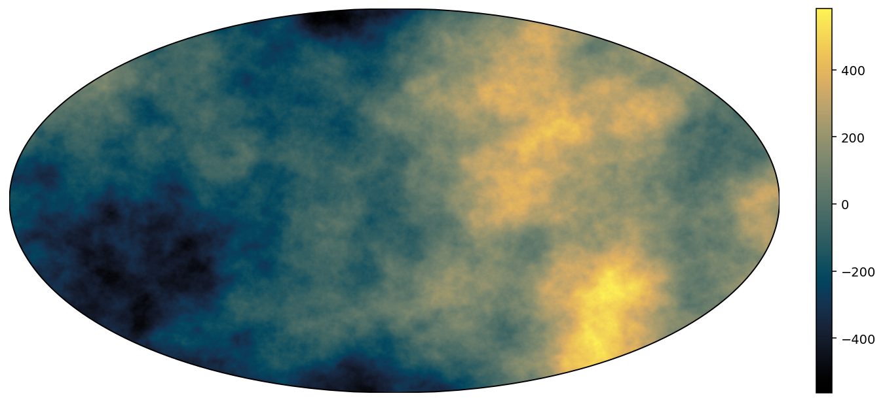
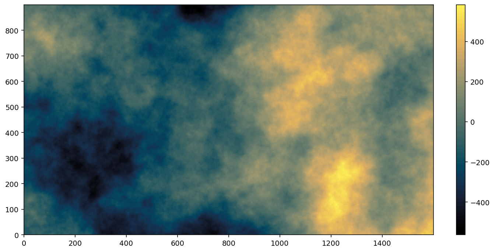

# spherical-fractional-brownian-surface

Python implementation for fast generation of spherical fractional Brownian surfaces with given Hurst exponent in
equirectangular projection (each pixel spans an equal number of degrees in longitude
and latitude) but also planar fractional Brownian surfaces. The surfaces admit an exact height-height correlation function that decays with $r^{-2H}$
but are not isotropic.

The surfaces are generated by overlapping multiple one-dimensional fractional Brownian motions on top of each-other at different orientations.
As the number of components is increased, the surfaces become more isotropic. The fractional Brownian motions are generated using Hoskin's algorithm via the `stochastic` package and the code is sped up with `numba`.

The time complexity for the algorithms are O(n^2 * num\_components + n^2 * fbm\_interpolation\_coef) and the memory footprint is O(n^2 * n\_threads + n * fbm\_interpolation\_coef), where $n=\mathrm{max}(n_x, n_y)$.

