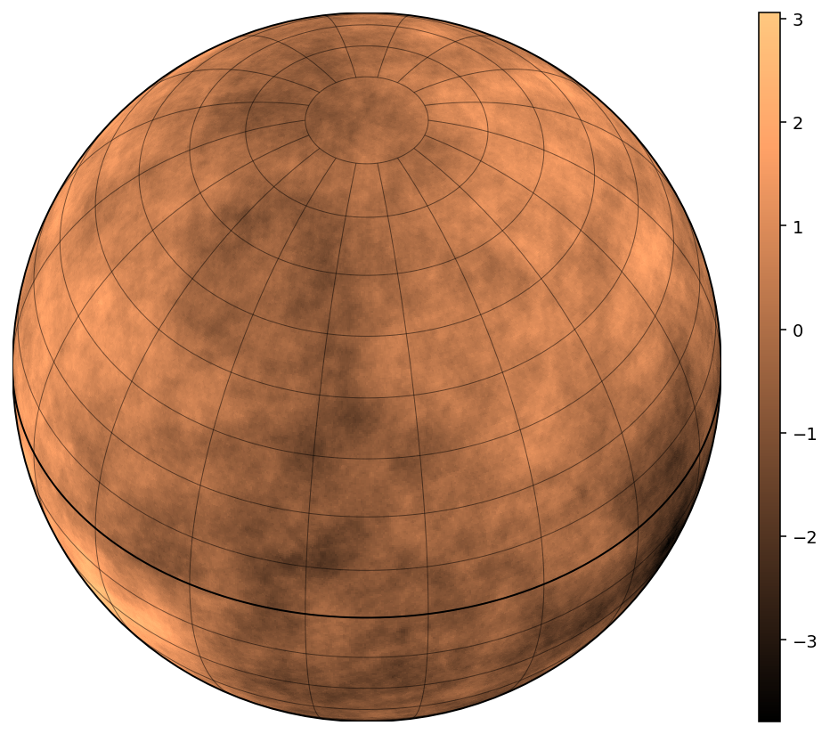
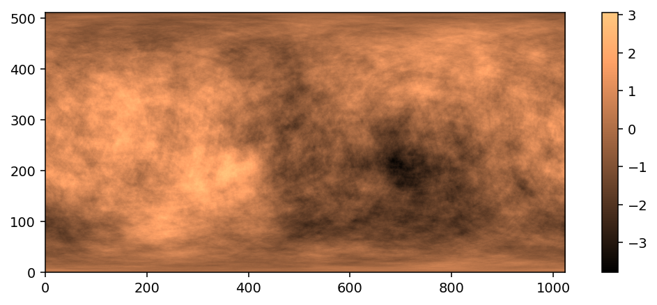

# spherical-fractional-brownian-surface

Python implementation for fast but approximate algorithm for generating spherical fractional Brownian surfaces with given Hurst exponent in
equirectangular projection (each pixel spans an equal number of degrees in longitude
and latitude) but also planar fractional Brownian surfaces. The surfaces tend to more and more ideal as the number of components is increased (see theory).

## Theory

The surfaces are generated using the [turning bands method](https://doi.org/10.1029/WR018i005p01379). Instead of simulating the two-dimensional surface directly, multiple one-dimensional fractional Brownian motions (fBms) are simulated along several lines at different orientations. The resulting field is obtained by the sum of the values of the one-dimensional fBms along the respective positions along each line. 

In the planar case, the lines are spaced evenly on the unit circle (for discussion on the benefits over randomly spaced lines, see the original paper) and for the spherical case, the lines are oriented randomly on the unit sphere.

While this doesn't mathematically result in fractional Brownian surfaces (isotropy isn't satisfied), the limit case of high number of lines does. In practice having in the order of 50+ lines is sufficient. The advantage of the approach over other exact methods (e.g. Stein's method) is its speed and memory usage, mainly due to only needing to simulate one-dimensional processes.

The expected height-height correlation functions on planar and spherical surfaces are validated in `notebooks/surface_validation.ipynb`.

## Implementation

The fractional Brownian motions are generated using Hoskin's algorithm via the [stochastic](https://pypi.org/project/stochastic/) package and the code is sped up with [numba](https://pypi.org/project/numba/).

The time complexity of the algorithm is O(n^2 * `num_components` / `n_threads` + n^2 * `num_components` * `fbm_interpolation_coef`^2) and the memory footprint is O(n^2 * `n_threads` + n * `fbm_interpolation_coef` * `num_component`), where $n=\mathrm{max}(n_x, n_y)$ is the maximal number of simulated pixels along a direction, `num_components` is the number of simulated lines, `fbm_interpolation_coef` is how many times the one-dimensional processes are upsampled compared to the pixel sizes of the two-dimensional surface and `n_threads` is the number of threads used for parallelization (only on CPU using `multiprocessing`).


Usage
--------
```py
import fbs

plane = fbs.PlanarFractionalBrownianSurface(a_x=1, a_y=1, H=0.5, num_components=50, seed=7)
z_planar = plane.evaluate_grid(n_x=1600, n_y=900)
z_planar_points = plane.evaluate_points(np.array([0.2, 0.5]), np.array([0.5, 0.5]))

sphere = fbs.SphericalFractionalBrownianSurface(n_fbm=2048*64, H=0.7, num_components=50, seed=13)
z_spherical = sphere.evaluate_equilateral(n_x=1024, n_threads=2)
```
`notebooks/example_notebook.ipynb` contains the code used to produce the example plots.

Example results
--------


